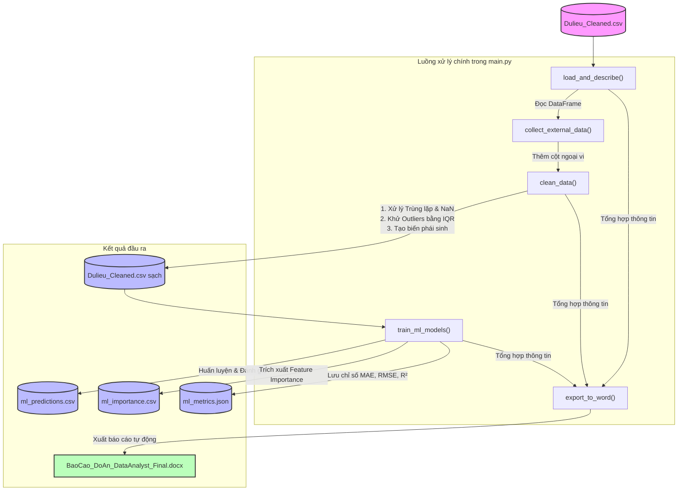

# Hướng dẫn chạy Luồng Pipeline Xử lý Dữ liệu & Huấn luyện Machine Learning

Tài liệu này hướng dẫn chi tiết cách vận hành luồng xử lý dữ liệu (pipeline) và huấn luyện mô hình dự báo giá bất động sản New York (NYC).

---

## 1. Mô tả Luồng Xử lý (Pipeline Workflow)

Luồng xử lý chính được định nghĩa trong file [src/main.py](file:///../src/main.py) bao gồm 4 bước chính:



### Chi tiết các bước:
1. **Làm giàu dữ liệu (Data Enrichment):** Ghép thêm các chỉ số kinh tế - xã hội (mật độ dân số, thu nhập bình quân, GDP khu vực, điểm tiện ích, khoảng cách tới trung tâm) dựa trên mã Quận (`borough`).
2. **Làm sạch dữ liệu (Data Cleaning):**
   - Loại bỏ các dòng trùng lặp.
   - Điền giá trị thiếu (`NaN`): sử dụng trung vị (`median`) cho các cột số và giá trị xuất hiện nhiều nhất (`mode`) cho các cột phân loại.
   - Xử lý các giá trị ngoại lai (`outliers`) bằng phương pháp **IQR clipping** trên các trường quan trọng: `sale_price`, `gross_sqft`, `land_sqft`.
   - Tạo các biến phái sinh: `is_residential` (nhà ở hay thương mại), `price_per_sqft_real` (đơn giá thực tế), `sale_month` (tháng giao dịch).
3. **Huấn luyện mô hình Machine Learning:**
   - Sử dụng các đặc trưng học máy: `gross_sqft`, `land_sqft`, `total_units`, `building_age`, `pop_density`, `avg_income`, `gdp_local`, `dist_center`, `amenity_score`.
   - Chia tập dữ liệu Train/Test theo tỷ lệ 80/20.
   - Huấn luyện và đánh giá hai thuật toán: **Linear Regression** (Hồi quy tuyến tính) và **Random Forest Regressor** (Rừng ngẫu nhiên).
   - Đo lường bằng các chỉ số: MAE, RMSE và hệ số xác định $R^2$.
4. **Xuất báo cáo tốt nghiệp (.docx):**
   - Tự động điền dữ liệu thống kê, bảng so sánh hiệu năng của mô hình ML và độ quan trọng của đặc trưng vào file báo cáo Word để phục vụ trình bày đồ án tốt nghiệp.

---

## 2. Hướng dẫn Khởi chạy

### Yêu cầu hệ thống
Đảm bảo bạn đã cài đặt các thư viện cần thiết bằng cách chạy lệnh:
```powershell
pip install pandas numpy scikit-learn python-docx streamlit plotly
```

### Lệnh chạy Pipeline
Để thực thi toàn bộ luồng tiền xử lý, huấn luyện mô hình và xuất báo cáo Word, mở terminal tại thư mục gốc của dự án và chạy:
```powershell
python src/main.py
```

### Lệnh chạy Dashboard trực quan
Sau khi pipeline hoàn tất, bạn có thể xem biểu đồ và tương tác với dữ liệu thông qua Dashboard Streamlit:
```powershell
streamlit run src/dashboard.py
```

---

## 3. Các File Đầu ra (Outputs)

Sau khi chạy xong pipeline, các file kết quả sẽ được cập nhật tại:
* **Dữ liệu sạch đã xử lý:** [data/data clean/Dulieu_Cleaned.csv](file:///../data/data%20clean/Dulieu_Cleaned.csv)
* **Kết quả dự đoán (dành cho Dashboard):** [output/ml_predictions.csv](file:///../output/ml_predictions.csv)
* **Độ quan trọng của đặc trưng:** [output/ml_importance.csv](file:///../output/ml_importance.csv)
* **Chỉ số đánh giá mô hình (JSON):** [output/ml_metrics.json](file:///../output/ml_metrics.json)
* **Báo cáo tốt nghiệp Word:** [reports/BaoCao_DoAn_DataAnalyst_Final.docx](file:///../reports/BaoCao_DoAn_DataAnalyst_Final.docx)

---

## 4. Nhật ký Chạy thực tế (Actual Execution Log)

Dưới đây là log màn hình hiển thị chính xác khi chạy lệnh `python src/main.py` trên hệ thống:

```text
=== PIPELINE BẮT ĐẦU ===

[LOG] Step 1: Thu thập & ghép dữ liệu ngoại vi (Census, GDP, Amenities)...
[LOG] Step 2: Làm sạch dữ liệu (dedup, impute, IQR, encoding)...
       Đã xóa 0 dòng trùng lặp.
       Dữ liệu sạch đã lưu: C:\Users\phong\Downloads\DATN_DP02_NYC\data\data clean\Dulieu_Cleaned.csv  (47,039 dòng)
[LOG] Step 3: Huấn luyện mô hình (Linear Regression vs Random Forest)...
       Random Forest R² = 0.4788
       Predictions saved: C:\Users\phong\Downloads\DATN_DP02_NYC\output\ml_predictions.csv
[LOG] Step 4: Tạo báo cáo Word tự động (.docx)...
[SUCCESS] Báo cáo đã lưu: C:\Users\phong\Downloads\DATN_DP02_NYC\reports\BaoCao_DoAn_DataAnalyst_Final.docx

=== PIPELINE HOÀN THÀNH ===
  • Dữ liệu sạch : C:\Users\phong\Downloads\DATN_DP02_NYC\data\data clean\Dulieu_Cleaned.csv
  • Dự báo ML    : C:\Users\phong\Downloads\DATN_DP02_NYC\output\ml_predictions.csv
  • Importance   : C:\Users\phong\Downloads\DATN_DP02_NYC\output\ml_importance.csv
  • Metrics JSON : C:\Users\phong\Downloads\DATN_DP02_NYC\output\ml_metrics.json
  • Báo cáo Word : C:\Users\phong\Downloads\DATN_DP02_NYC\reports\BaoCao_DoAn_DataAnalyst_Final.docx
```

